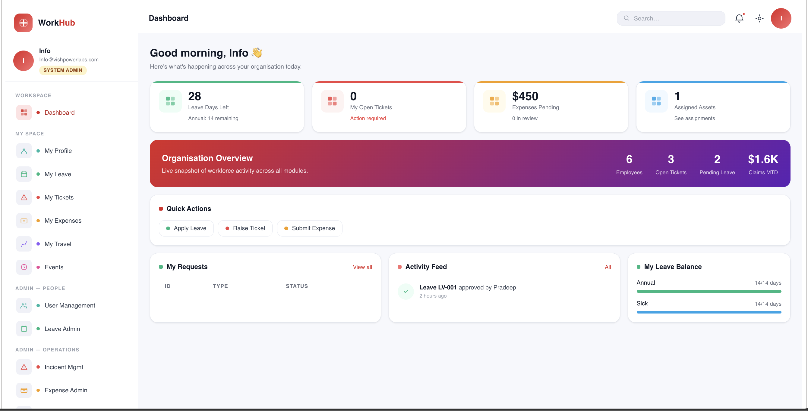
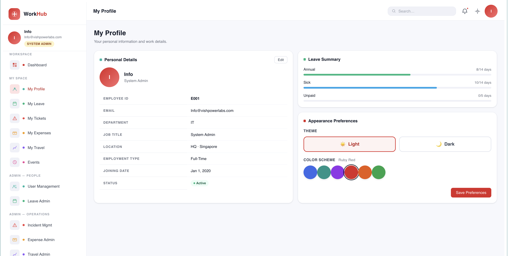
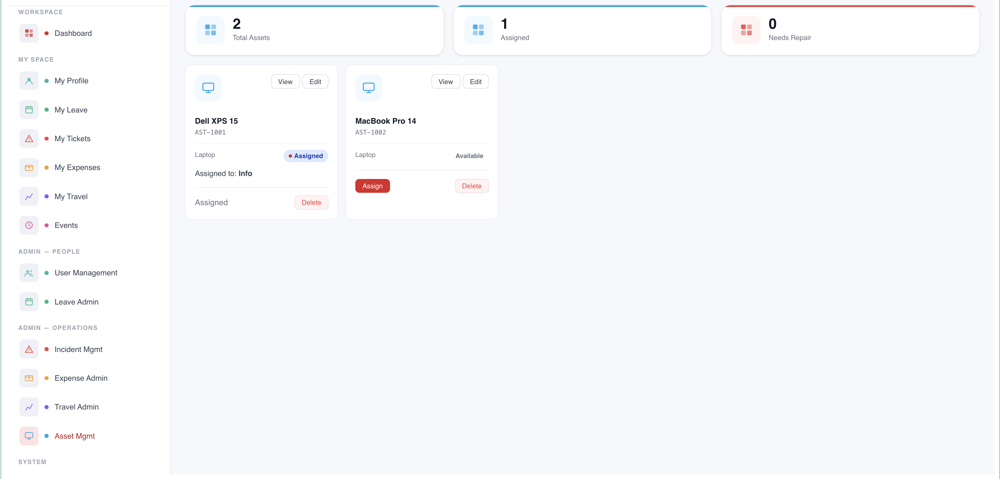

# SharePoint Framework (SPFx) Web Part - Employee Hub

Welcome to the **SharePoint Framework (SPFx) Web Part** version of the Digital Workplace Employee Hub! 
This application provides native, deep integration into Microsoft 365, allowing the Employee Hub to run seamlessly inside modern SharePoint pages and Microsoft Teams.

## Screenshots
*(Please add the following images to the `screenshots/` folder to display them here)*





## Application Overview

The SPFx Employee Hub acts as a centralized portal directly inside your company Intranet. It leverages SharePoint lists and libraries to store backend data, giving administrators full control and security over organizational information without requiring an external database.

### Key Features
- **Native M365 Integration:** Operates directly within SharePoint Online, leveraging native Azure AD single sign-on (SSO).
- **SharePoint List Data Layer:** Read, write, and manage data (Leaves, Assets, Tickets, Events) directly in SharePoint Lists.
- **Dynamic Navigation & Roles:** Automatically queries the current user's SharePoint context to resolve their role (e.g., HR Admin, IT Admin, Standard Employee) and displays relevant modules.
- **Dark Mode Support:** Adapts to SharePoint theme overrides and local preferences.
- **Modules Included:**
  - **Dashboard:** At-a-glance view of tasks, announcements, and quick actions.
  - **User Management:** View organization charts and employee data.
  - **Leave Administration:** Admin tools to configure leave types and allocate balances.
  - **Asset Management:** IT Asset tracking, assignment, and real-time updates.
  - **Incident Management:** SharePoint-backed ticketing system for IT and HR.
  - **Company Events:** Company-wide holiday calendar and interactive event management.

## Toolchain & Technologies

This project uses the standard Microsoft SPFx toolchain combined with modern web tools:
- **Framework:** React 17/18 (Depending on SPFx version constraints)
- **Language:** TypeScript
- **Toolchain:** Microsoft SPFx Build Tools (Gulp, Webpack, Yeoman generator)
- **API Interoperability:** `SPHttpClient` and `@microsoft/sp-http` for secure REST calls to SharePoint.
- **Styling:** Vanilla CSS (Zero dependency, custom CSS variables)

## Requirements

To run and build this project locally, you must ensure your environment meets Microsoft's SPFx prerequisites:
- **Node.js**: v16.x or v18.x (Strictly adheres to SPFx compatibility matrices)
- **Gulp CLI**: Installed globally (`npm install -g gulp-cli`)
- **Yeoman**: Installed globally (`npm install -g yo`)
- **SharePoint Tenant:** Access to an M365 Developer Tenant or a standard SharePoint Online environment for testing.

## Deployment & List Setup

### Automated SharePoint List Creation
This Web Part relies on several backend SharePoint lists to function correctly (e.g., EmployeeMaster, LeaveRequests, IncidentRequests, etc.). 
Instead of creating these manually, you can automatically scaffold all required lists and columns by running the provided PowerShell script located in the root directory of the repository:
```bash
./Deploy-IntranetApp.ps1
```
*Note: Ensure you run this script against your target site collection before deploying the SPFx package, as the web part dynamically maps to these lists.*

## Getting Started

1. **Install Dependencies:**
   Navigate to the project root (`digital-workplace-employee-hub-spfx`) and install dependencies.
   ```bash
   npm install
   ```

2. **Trust the Local Dev Certificate:**
   Required for serving the local workbench over HTTPS.
   ```bash
   gulp trust-dev-cert
   ```

3. **Run the Local Workbench:**
   Start the local development server to test the web part without deploying.
   ```bash
   gulp serve
   ```
   *(Note: Since this web part relies on actual SharePoint lists, you should test it on the hosted workbench: `https://yourtenant.sharepoint.com/_layouts/15/workbench.aspx`)*

4. **Package for Deployment:**
   Bundle and package the solution to generate the `.sppkg` file for the SharePoint App Catalog.
   ```bash
   gulp bundle --ship
   gulp package-solution --ship
   ```
   The `.sppkg` file will be found in the `sharepoint/solution` folder.

## Frequently Asked Questions (FAQ)

**Q: Do I need to create the SharePoint Lists manually?**  
A: Yes, you must ensure the required SharePoint lists (e.g., `userPreferences`, `employeeMaster`, `leaveRequests`, etc.) are created in the host site. The application maps data dynamically by looking up internal field names based on display names, so ensure list columns match the documented schemas.

**Q: Why does the web part look different in the local workbench vs SharePoint?**  
A: The local workbench (`localhost`) lacks true SharePoint context (like user roles and list data). Always test against the hosted workbench (`https://yourtenant.sharepoint.com/.../workbench.aspx`) to verify data fetching logic.

**Q: How do I change the theme colors?**  
A: All theme colors are managed through CSS variables in the primary CSS files. However, SPFx also allows injecting SharePoint Theme variables. You can configure the CSS to fall back to native SharePoint theme slots (e.g., `"[theme: themePrimary, default: #0078d4]"`) for tighter integration.