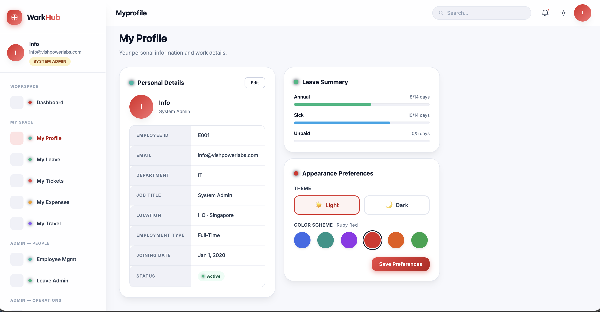
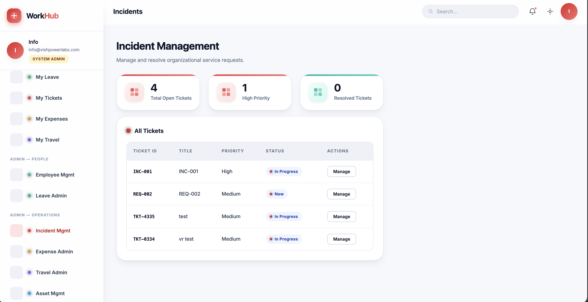
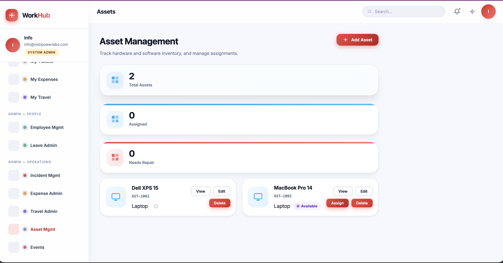

# Power Apps Code App - Employee Hub

Welcome to the **Power Apps Code App** version of the Digital Workplace Employee Hub! 
This application is designed as a standalone Single Page Application (SPA) that can be embedded into Microsoft Power Apps using a PCF (Power Apps Component Framework) control, or run independently in a browser environment.

## Screenshots
*(Please add the following images to the `screenshots/` folder to display them here)*





## Application Overview

The Employee Hub acts as a centralized portal for employees and administrators to interact with day-to-day corporate services. Its primary goal is to provide a unified, highly aesthetic interface across various business modules, including user management, leave requests, asset assignments, and incident ticketing.

### Key Features
- **Dynamic Navigation:** The left sidebar navigation automatically adapts based on the user's role (e.g., HR Admin, IT Admin, Manager, Standard Employee).
- **Responsive Layout:** A flexible CSS grid system guarantees optimal viewing on desktops, tablets, and mobile devices.
- **Dark Mode Support:** Full support for system-based and user-toggled dark modes, enabled via comprehensive CSS variable usage.
- **Modules Included:**
  - **Dashboard:** At-a-glance view of tasks, announcements, and quick actions.
  - **User Management:** Manage employee profiles and organizational data.
  - **Leave Administration:** Request, approve, and track employee leave balances.
  - **Asset Management:** IT Asset tracking, assignment, and status updates.
  - **Incident & Ticket Management:** Raise, track, and resolve IT/HR helpdesk tickets.
  - **Expense & Travel:** Manage corporate expense claims and travel requests.

## Toolchain & Technologies

This project uses modern web development tools:
- **Framework:** React 18
- **Language:** TypeScript
- **Bundler:** Vite
- **Styling:** Vanilla CSS (Zero dependency, custom CSS variables for robust theming)
- **Linting:** ESLint with standard React and TypeScript rules

## Requirements

To run this project locally, you will need:
- **Node.js**: v16.x or higher
- **npm**: v7.x or higher (or Yarn/pnpm)

## Deployment & Tenant Configuration

### 1. SharePoint List Setup
This application relies on several SharePoint lists for data storage (e.g., EmployeeMaster, LeaveRequests, IncidentRequests, ExpenseClaims, etc.). 
To automatically scaffold and create these lists with the correct schema in your SharePoint site, run the provided PowerShell script located in the root directory of the repository:
```bash
./Deploy-IntranetApp.ps1
```

### 2. Tenant Configuration
To use this code app in your own Microsoft tenant, you must update the `power.config.json` file before running or building. Specifically, locate and modify these fields:

1. **Environment ID**:
   - Locate the `"environmentId"` field near the top of the file.
   - Replace it with your target Power Platform environment GUID (which can be found in your Power Platform Admin Center).

2. **Connection Reference ID**:
   - Before running the app, ensure you have a valid SharePoint connection in your environment.
   - Run the following Power Apps CLI command in your terminal to list your active connections:
     ```bash
     pac connection list
     ```
   - Locate your SharePoint connection in the output and copy its **Connection ID**.
   - Under `"connectionReferences"`, replace the existing GUID key (currently `"dfe9c37d-3150-4ecf-a582-b1754346ef53"`) with your copied Connection ID.

3. **SharePoint Site URL**:
   - Under `"connectionReferences"` -> `[Your Connection ID]` -> `"dataSets"`, you will see a JSON key with the placeholder SharePoint URL: `"https://devtenant0424.sharepoint.com/sites/DigitalWorkplace"`.
   - You must rename this entire JSON key to match the exact URL of the SharePoint site where you ran the deployment script.

## Getting Started

1. **Install Dependencies:**
   Navigate to the project root and install the required NPM packages.
   ```bash
   npm install
   ```

2. **Run the Development Server:**
   Start the Vite development server to view the app locally.
   ```bash
   npm run dev
   ```
   The app will typically be available at `http://localhost:5173`.

3. **Build for Production:**
   When you're ready to deploy or bundle for a PCF control, run the build command.
   ```bash
   npm run build
   ```
   The production-ready files will be generated in the `dist/` directory.

## Frequently Asked Questions (FAQ)

**Q: Can I use this without Power Apps?**  
A: Yes, the codebase is a standard React SPA. By modifying the data fetching layer (`dataService.ts`), you can connect this frontend to any backend REST API or database.

**Q: How do I change the theme colors?**  
A: All theme colors are managed through CSS variables in `index.css`. Simply modify the `--brand-*` or `--c-*` (category colors) variables to customize the look and feel.

**Q: How do I add a new module?**  
A: Create a new component in the `src/app-code/pages` directory, add the route definition to `App.tsx` inside the switch statement, and update `nav.ts` to include your new link in the sidebar navigation.
